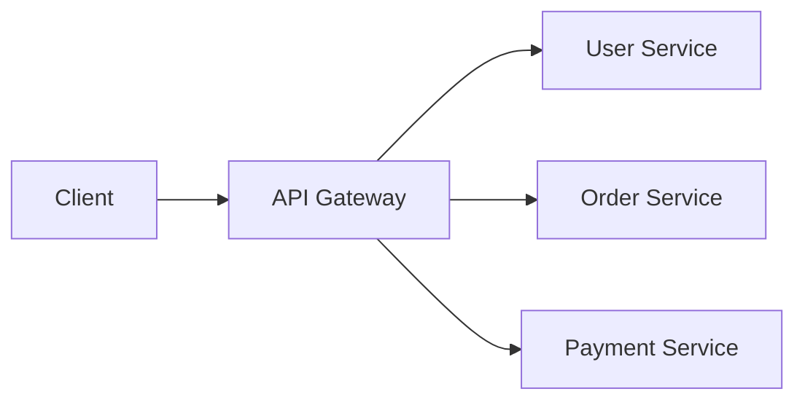
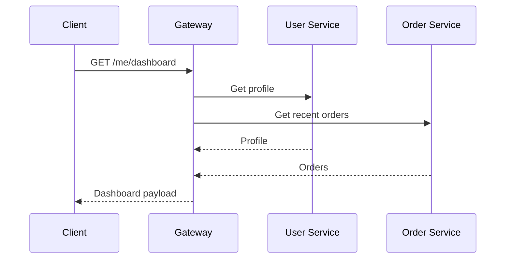

# API Gateways

An API gateway is a single entry point for client requests into a system. It sits in front of backend services and handles cross-cutting concerns before requests reach those services.

## What Gateways Do

An API gateway can handle:

- Routing requests to the right service.
- Authentication and authorization checks.
- Rate limiting.
- TLS termination.
- Request and response transformation.
- Logging and metrics.
- Response aggregation.
- API version routing.

This keeps repeated edge behavior out of every service.

## Gateway vs Load Balancer

| Concern | Load balancer | API gateway |
| --- | --- | --- |
| Primary job | Distribute traffic across instances | Manage API entry and cross-cutting behavior |
| Typical layer | Layer 4 or Layer 7 | Layer 7 |
| Knows API semantics | Sometimes | Usually |
| Examples | HAProxy, NGINX, cloud load balancers | NGINX, Kong, Envoy, API Gateway products |

The same product can sometimes do both. The design distinction matters more than the brand name.

## Response Aggregation

For mobile or frontend clients, the gateway may combine several backend calls into one response.

Aggregation can reduce client complexity and network round trips, but it can also make the gateway too smart. Keep business rules in backend services unless there is a clear reason to place them at the edge.

## Benefits

- One public entry point.
- Centralized authentication, throttling, and logging.
- Cleaner backend services.
- Easier API versioning and routing.
- Better client experience when aggregation is useful.

## Risks

- The gateway can become a bottleneck.
- Too much business logic at the gateway creates a new monolith.
- Misconfiguration can expose private services.
- Debugging can become harder when requests are transformed.

## Design Questions

- Which routes are public?
- Which services remain private?
- Where is authentication checked?
- What rate limits are needed?
- Does the gateway aggregate responses?
- How is the gateway scaled and monitored?

## Check Your Understanding

<quiz>
What is a common reason to add an API gateway?

- [x] To centralize API routing, authentication, rate limiting, and other edge concerns
> Correct. Gateways are useful when many clients and services would otherwise duplicate this behavior.
- [ ] To replace all databases
- [ ] To make every backend service public
- [ ] To remove the need for observability
</quiz>

