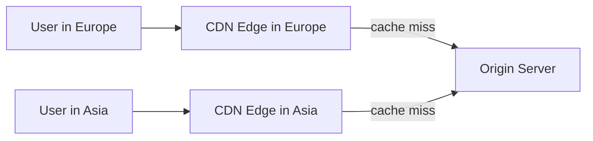
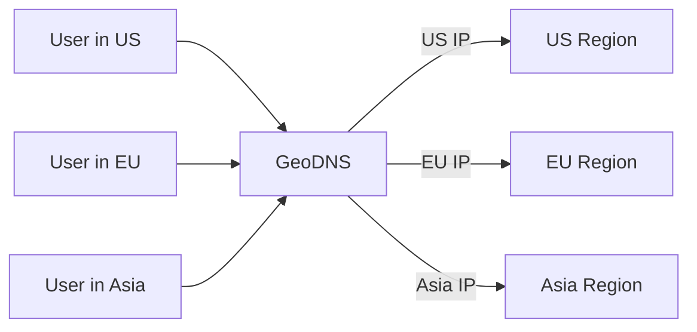

# CDN and GeoDNS

Global systems need to reduce the distance between users and the service. Two common tools are CDNs and GeoDNS.

## CDN

A **content delivery network (CDN)** is a distributed network of edge servers that serve content from locations close to users.

CDNs commonly cache:

- Images.
- Videos.
- CSS and JavaScript.
- Downloadable files.
- Public API responses.
- Static generated pages.

## CDN Benefits

- Lower latency for users far from the origin.
- Less traffic to the origin server.
- Lower bandwidth pressure.
- Better tolerance for traffic spikes.
- Built-in features such as TLS termination, compression, and DDoS protection in many providers.

## CDN Trade-offs

The main trade-off is freshness. If content is cached at many edge locations, changing it everywhere immediately is harder.

Design questions:

- What content can be cached?
- What is the TTL?
- How are assets versioned?
- How do we purge content after a mistake?
- Can users receive stale dynamic data?

## GeoDNS

**GeoDNS** returns different DNS answers based on the requester's location.

GeoDNS can route users to:

- The nearest region.
- A region with available capacity.
- A region allowed by data residency rules.
- A healthy region during an outage.

## CDN vs GeoDNS

| Feature | CDN | GeoDNS |
| --- | --- | --- |
| Main job | Serve cached content from edge locations | Choose which region/IP a user reaches |
| Best for | Static assets, public content, edge caching | Multi-region routing |
| Works at | HTTP/content layer | DNS layer |
| Freshness issue | Cached objects can become stale | DNS records can remain cached |

They are often used together. DNS sends the user to a suitable edge or region; the CDN serves cacheable content close to the user; origin servers handle misses and dynamic work.

## Multi-Region Caution

Adding regions improves latency and resilience, but introduces difficult questions:

- Where is the source of truth?
- How is data replicated?
- Can users write in multiple regions?
- What happens during network partition?
- Are there legal restrictions on where data lives?

For many systems, a CDN gives most of the latency benefit before the team needs full multi-region application complexity.

## Check Your Understanding

<quiz>
What is the main difference between a CDN and GeoDNS?

- [x] A CDN serves cached content near users, while GeoDNS decides which IP or region a user should reach
> Correct. They solve related but different global routing and delivery problems.
- [ ] GeoDNS stores images and videos at edge locations
- [ ] A CDN can only serve database writes
- [ ] They are two names for the same technology
</quiz>

