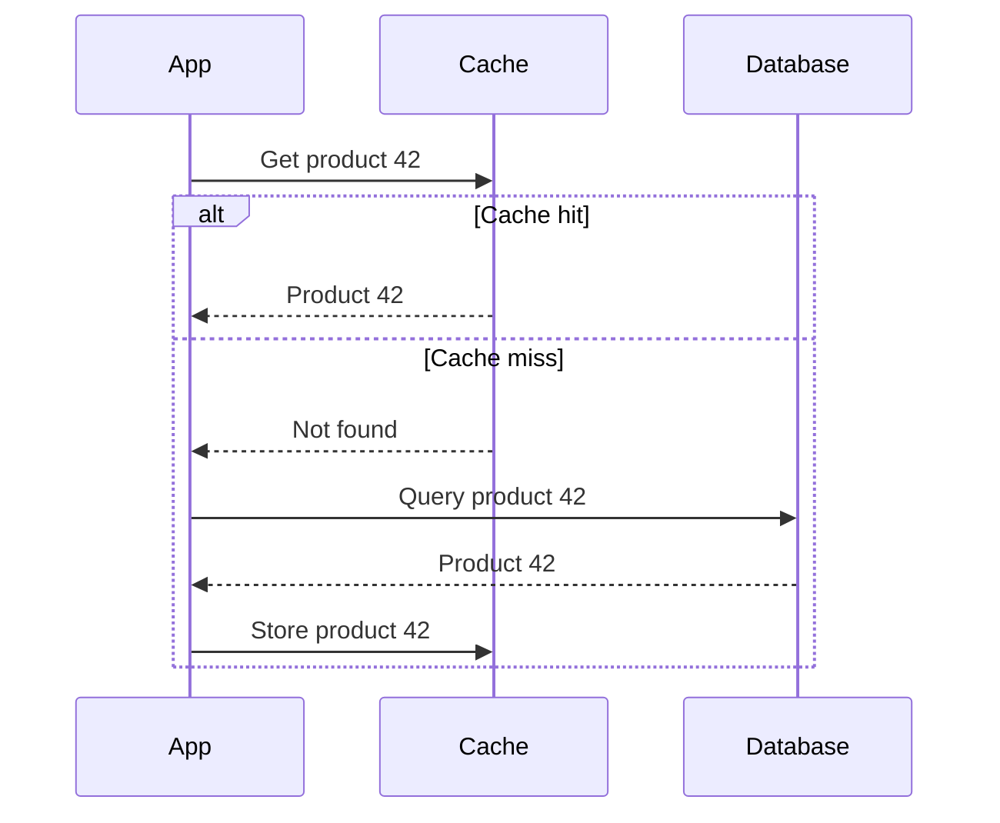
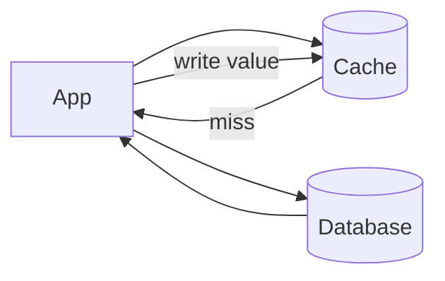

# Caching

A cache stores frequently used data in a faster place so the system can answer repeated requests with lower latency and less load on slower dependencies.

## Why Use a Cache?

- Reduce response time.
- Reduce database or API load.
- Absorb repeated reads.
- Lower infrastructure cost.
- Improve resilience during short downstream slowdowns.

Caches are especially useful for data that is read often and changes rarely: product catalogs, configuration, public profiles, session data, permissions, computed reports, and feature flags.

## Cache Placement

| Placement | Example | Use |
| --- | --- | --- |
| Client-side | Browser cache, mobile local cache | Avoid repeated network requests |
| CDN edge | Static files, public API responses | Serve users from nearby locations |
| Application memory | In-process map | Very fast local reads |
| Distributed cache | Redis, Memcached | Shared cache across many app servers |
| Database cache | Buffer pool, query cache | Speed up database internals |

## Common Strategies

### Cache-Aside

The application checks the cache first. On a miss, it reads from the database and stores the result in the cache.

This is simple and common. The application is responsible for keeping cache behavior correct.

### Read-Through

The application asks the cache for data. If the item is missing, the cache itself loads it from the database.

Read-through centralizes loading logic, but requires cache infrastructure that supports it.

### Write-Through

The application writes to the cache, and the cache writes to the database before confirming success.

This keeps cache and database aligned, but write latency is higher.

### Write-Back

The application writes to the cache and the cache writes to the database later.

This can be fast, but it risks data loss if the cache fails before the write reaches durable storage.

## TTL and Invalidation

A **time-to-live (TTL)** tells the cache when an entry expires.

Short TTL:

- Fresher data.
- More database traffic.

Long TTL:

- Better performance.
- More risk of stale data.

Cache invalidation is the act of removing or updating cached data when the source changes. It is one of the hardest parts of caching because stale data can look like correct data.

## Cache Stampede

A cache stampede happens when many requests miss the cache at the same time and all hit the database.

Common defenses:

- Lock or coalesce requests so only one request refreshes the item.
- Add jitter to TTLs so many keys do not expire at once.
- Refresh popular keys before they expire.
- Serve stale data briefly while refreshing in the background.

## Good Caching Questions

- What data is hot?
- How stale can this data be?
- What is the TTL?
- Who invalidates the cache?
- What happens on cache failure?
- Can a cache miss overload the database?
- Is the cache a performance optimization or a required source of truth?

## Check Your Understanding

<quiz>
Which data is usually a good caching candidate?

- [x] Frequently read data that changes rarely
> Correct. Caching works best when many requests can reuse the same value safely.
- [ ] One-time passwords that must never be reused
- [ ] Every write before it reaches durable storage
- [ ] Data whose correctness must be real-time and exact for every read
</quiz>

