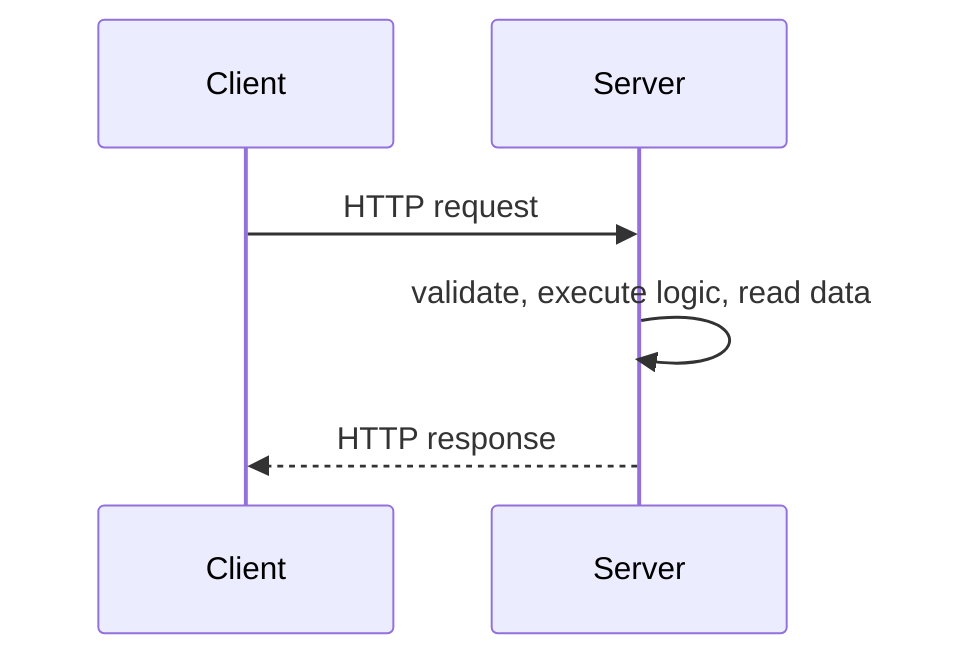
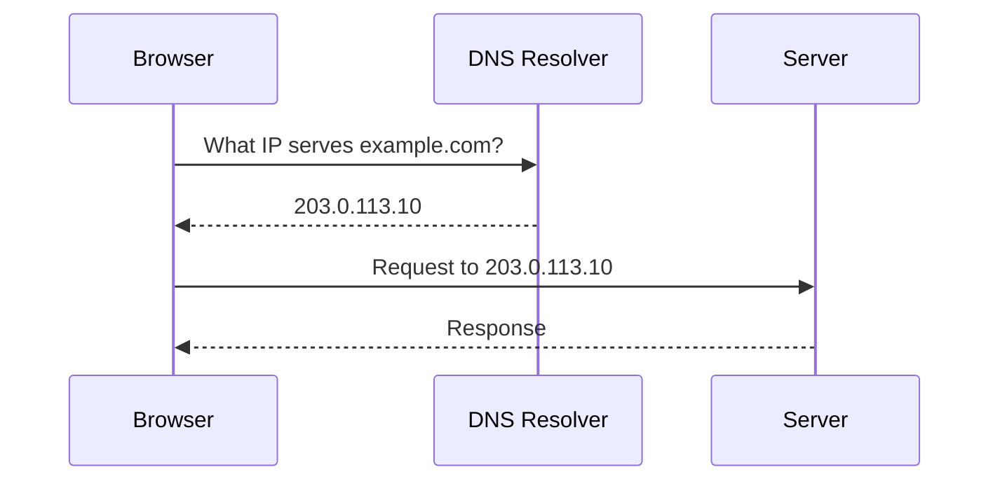

# Client, Server, and DNS

Most networked systems begin with three ideas: a client asks for something, a server responds, and DNS helps the client find the server.

## Client and Server

A **client** is a device or application that requests data or functionality. A **server** listens for requests, runs business logic, reads or writes data, and returns a response.

Separating client and server keeps responsibilities clear:

- Clients handle presentation, input, and local interaction.
- Servers handle shared logic, security checks, persistence, and integration.
- Each side can be deployed, secured, and scaled independently.

## Why the Separation Matters

If every client contained all business rules and direct database access, every update would be hard to coordinate and every client would become a security risk. With a server in the middle, sensitive logic and data access stay in a controlled environment.

| Concern | Usually belongs in |
| --- | --- |
| User interface | Client |
| Authentication checks | Server |
| Business rules | Server |
| Local form validation | Client |
| Database writes | Server |
| Offline drafts or cache | Client |

## DNS

The **Domain Name System (DNS)** maps human-readable names to network addresses.

DNS decouples a stable name from the physical machines behind it. You can move a service to a new server, add more addresses, or route users to different regions without changing the URL users type.

## DNS in System Design

DNS can support:

- **Service mobility**: change the IP address behind a name.
- **Redundancy**: keep multiple records for the same service.
- **Regional routing**: send users to a nearby region.
- **Disaster recovery**: route traffic away from an unhealthy location.

DNS is powerful, but not instant. Records are cached for a period called **TTL**. A low TTL makes changes propagate faster but increases DNS traffic. A high TTL reduces lookup traffic but makes failover slower.

## Basic Starting Point

This is enough for a tiny application. As the system grows, the next common step is adding persistent storage.

## Check Your Understanding

<quiz>
Why does DNS help system evolution?

- [x] It lets a stable service name point to different underlying addresses over time
> Correct. Users keep using the same domain while the infrastructure can move or grow.
- [ ] It stores application data permanently
- [ ] It guarantees that every request reaches the same server
- [ ] It replaces authentication between clients and servers
</quiz>

