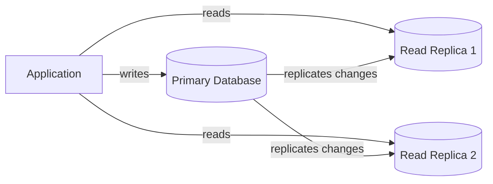
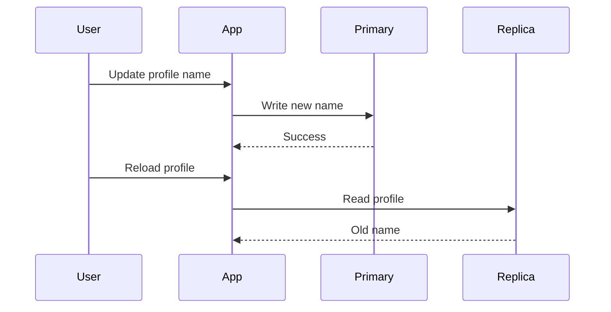
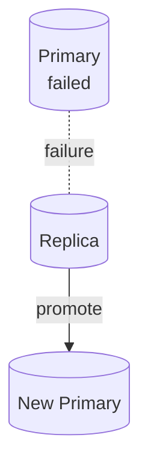

# Database Replication

Database replication copies data from one database node to another. It is used to improve read scalability, availability, and disaster recovery.

The most common introductory model is **primary-replica** replication.

## Primary and Replicas

The **primary** database accepts writes. Replicas receive copied changes from the primary and can serve read traffic.

This helps when the system has many more reads than writes, which is common in products like news sites, catalogs, profiles, and dashboards.

## Benefits

- Read traffic can be spread across replicas.
- Reporting queries can avoid overloading the primary.
- If the primary fails, a replica may be promoted.
- Replicas can be placed in another region for disaster recovery.
- Backups can sometimes run from replicas to reduce primary load.

## Replication Lag

Replication is often asynchronous. A write may commit on the primary before it appears on every replica. This delay is called **replication lag**.

Example:

Replication lag can surprise users. A common fix is **read-your-writes** routing: after a user writes data, read that user's next request from the primary or from a replica known to be caught up.

## Failover

If the primary fails, one replica can be promoted to become the new primary.

Failover improves availability, but it is not free. The system must decide which replica is most up to date, redirect writes, prevent two primaries from accepting conflicting writes, and verify that clients reconnect correctly.

## Common Trade-offs

| Choice | Benefit | Cost |
| --- | --- | --- |
| Async replication | Fast writes | Replicas may be stale |
| Sync replication | Stronger consistency | Writes are slower |
| Many replicas | More read capacity | More replication load and lag risk |
| Cross-region replica | Disaster recovery | More latency and operational complexity |

## When to Use It

Use replication when:

- Reads are overloading the primary.
- The system needs high availability.
- You need a warm standby for disaster recovery.
- Analytics or backups interfere with production writes.

Replication does not solve every database scaling problem. If writes are the bottleneck, you may need indexing changes, batching, partitioning, sharding, or a different data model.

## Check Your Understanding

<quiz>
What is the main risk of reading from an asynchronously replicated read replica?

- [x] The replica may return stale data because it has not received the latest write yet
> Correct. This delay is replication lag.
- [ ] The replica can never serve queries
- [ ] The primary stops accepting writes
- [ ] The application no longer needs backups
</quiz>

