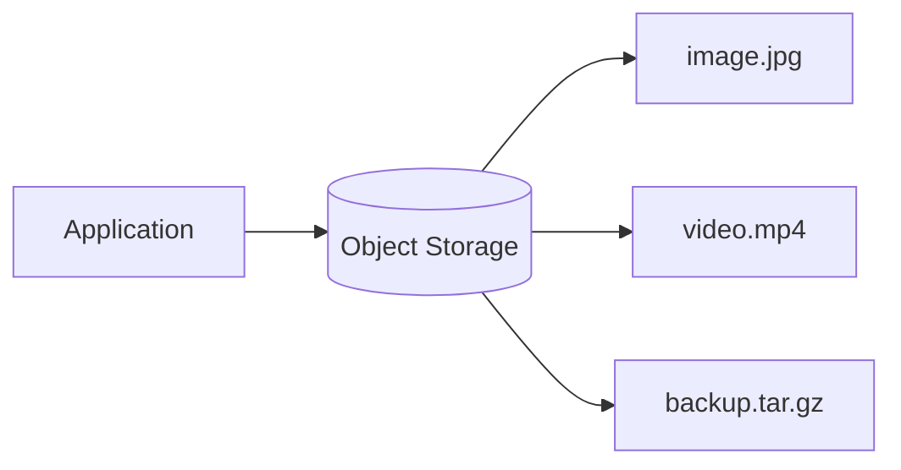
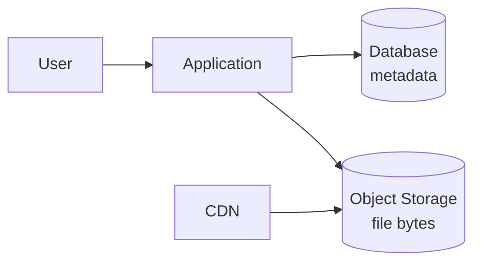
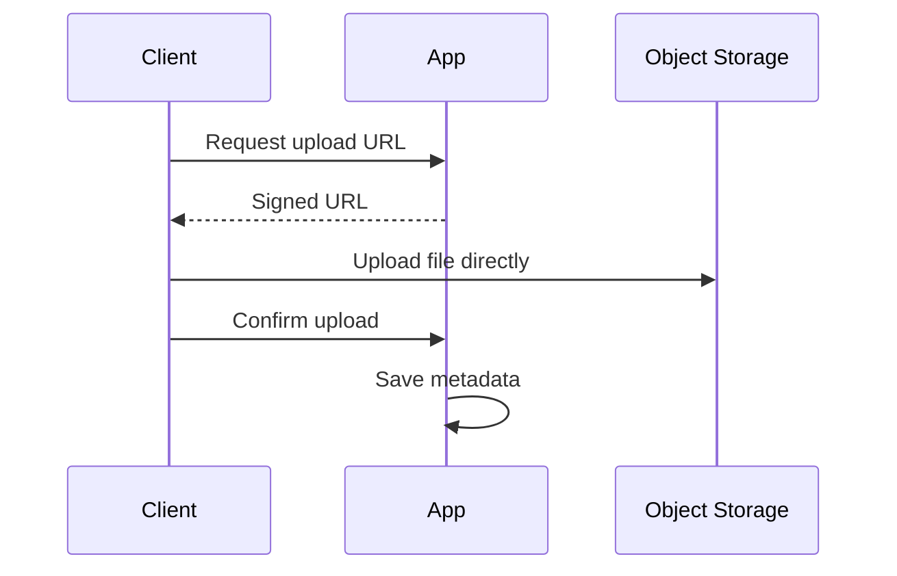

# Object Storage

Object storage stores data as objects rather than rows, files in a traditional file system, or fixed-size disk blocks.

Each object usually contains:

- The data itself.
- Metadata.
- A unique key or identifier.

Object storage is commonly used for unstructured data such as images, videos, documents, backups, logs, exports, and large generated files.

## Why Not Store Files in the Database?

Small files can be stored in a database, but large binary objects often make databases slower and harder to operate.

A common pattern is:

1. Store the object in object storage.
2. Store metadata and the object key in the database.
3. Serve public or authorized downloads through the application, CDN, or signed URLs.

## Object Storage Benefits

- Scales to very large amounts of data.
- Usually cheaper than database storage for large files.
- Built-in replication and durability in many systems.
- Simple key-based access.
- Works well with CDNs.
- Supports direct upload and download patterns.

Examples:

- Amazon S3
- Google Cloud Storage
- Azure Blob Storage
- MinIO

## Common Concepts

| Concept | Meaning |
| --- | --- |
| Bucket | A top-level container for objects |
| Object key | The unique name/path used to retrieve an object |
| Metadata | Extra information such as content type, owner, or size |
| Versioning | Keeping older versions of objects |
| Lifecycle policy | Rules for moving or deleting old objects |
| Signed URL | Temporary URL granting limited access |

## Direct Uploads

For large uploads, the application can issue a signed upload URL and let the client send bytes directly to object storage.

This keeps large file traffic away from application servers.

## Design Questions

- What types of objects are stored?
- Are objects public or private?
- How are permissions enforced?
- Should downloads use signed URLs?
- Is versioning required?
- When should old objects be archived or deleted?
- Should a CDN serve these objects?

## Check Your Understanding

<quiz>
Why do systems often store large images or videos in object storage instead of directly inside a relational database?

- [x] Object storage is better suited for large unstructured files and can scale cheaply with CDN-friendly access
> Correct. The database can keep metadata while object storage keeps the large bytes.
- [ ] Relational databases cannot store any text
- [ ] Object storage automatically replaces application servers
- [ ] CDNs can only read from SQL tables
</quiz>

