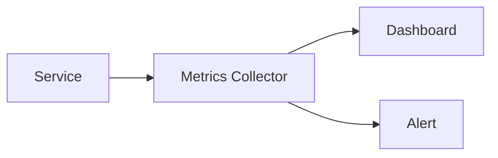
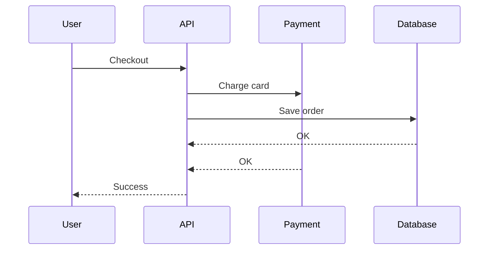

# Observability and Automation

A system is not truly designed until the team can see how it behaves in production and respond when it drifts from healthy behavior.

Observability answers: **What is happening? Why is it happening? How bad is it?**

## Logs

Logs are discrete records of events.

Examples:

- Request started.
- Payment provider returned an error.
- User permission check failed.
- Worker retried a job.
- Database migration completed.

Good logs include context: timestamp, service name, request ID, user or tenant ID when appropriate, operation name, and error details.

```text
2026-04-18T10:15:42Z level=error service=payment request_id=abc123 order_id=42 message="provider timeout"
```

Logs are useful for debugging specific events and reconstructing what happened.

## Metrics

Metrics are numerical measurements over time.

Common metrics:

- Request rate.
- Error rate.
- Latency.
- CPU and memory usage.
- Queue depth.
- Database connection count.
- Cache hit ratio.



Metrics are useful for dashboards, alerting, capacity planning, and service-level objectives.

## Traces

Distributed traces follow one request across multiple services.



Tracing helps when latency or failures happen across service boundaries and no single log line explains the whole story.

## Alerts

Alerts should fire when users are affected or when a known leading indicator predicts user impact.

Useful alert examples:

- Error rate is above the agreed threshold.
- p95 latency is too high for several minutes.
- Queue depth keeps growing.
- Disk space is close to full.
- No worker has processed a job recently.

Avoid alerting on every noisy symptom. Too many low-value alerts teach teams to ignore them.

## Automation

Automation uses signals from the system to take action.

Examples:

- Auto-scale app servers when CPU or request rate rises.
- Restart failed containers.
- Move traffic away from an unhealthy instance.
- Run scheduled backups.
- Roll back a deployment after health checks fail.
- Open an incident when an alert crosses severity rules.

Automation can make systems self-healing, but it must be observable and reversible. A bad automation can turn a small failure into a larger one.

## Common Tooling

| Need | Example tools |
| --- | --- |
| Logs | Elasticsearch, Logstash, Kibana, Loki |
| Metrics | Prometheus, Grafana, Datadog |
| Traces | OpenTelemetry, Jaeger, Tempo |
| Alerts | Alertmanager, PagerDuty, Opsgenie |
| Automation | Kubernetes, systemd, cloud auto scaling |

## Check Your Understanding

<quiz>
Which signal is best for alerting that background workers are falling behind?

- [x] Queue depth or message age increasing over time
> Correct. It directly shows that producers are adding work faster than consumers finish it.
- [ ] The number of CSS files served by the CDN
- [ ] The name of the primary database
- [ ] The color of the dashboard theme
</quiz>

