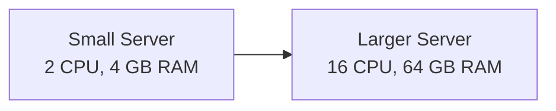
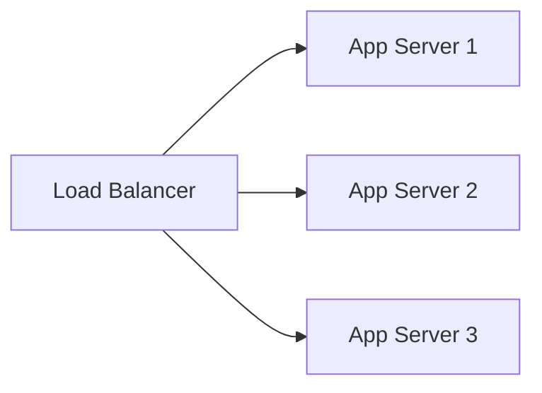

# Scaling

Scaling means increasing a system's ability to handle more users, requests, data, or background work.

There are two basic moves: make one machine bigger, or add more machines.

## Vertical Scaling

**Vertical scaling** means adding more resources to an existing server: CPU, memory, disk, network capacity, or faster storage.

Advantages:

- Simple to understand.
- Usually requires fewer application changes.
- Useful when a database or legacy system cannot easily be split.

Limitations:

- Every machine has a maximum size.
- Large machines can be expensive.
- One machine can still be a single point of failure.
- Scaling up may require downtime.

## Horizontal Scaling

**Horizontal scaling** means adding more servers and distributing work across them.

Advantages:

- Can grow gradually by adding instances.
- Improves fault tolerance when one instance fails.
- Works well for stateless application servers and worker fleets.

Limitations:

- Requires traffic distribution.
- Requires coordination, deployment automation, and monitoring.
- Shared state must move out of individual servers.
- Data consistency can become harder.

## What Usually Scales First?

Application servers are often the easiest part to scale horizontally. Databases are harder because they hold shared state.

| Component | Common scaling approach |
| --- | --- |
| Web/app servers | Horizontal scaling behind a load balancer |
| Background workers | Horizontal scaling from a queue |
| Relational databases | Vertical scaling, read replicas, partitioning |
| NoSQL databases | Horizontal scaling and partitioning |
| Static assets | CDN |
| Hot reads | Cache |

## Bottlenecks

A bottleneck is the part of the system limiting overall throughput.

Common bottlenecks:

- CPU-bound application logic.
- Slow database queries.
- Too many database connections.
- Disk I/O.
- Network bandwidth.
- Third-party APIs.
- Lock contention or serialized work.

Do not scale blindly. Measure first, then scale the component causing the pain.

## Scaling and Complexity

Scaling decisions trade simplicity for capacity. A single server is easier to build and debug than a distributed system. A distributed system can handle more load, but it creates new problems: partial failure, duplicated work, stale data, network latency, and operational overhead.

The best design uses the simplest scaling strategy that satisfies the requirements.

## Check Your Understanding

<quiz>
Why are stateless application servers easier to scale horizontally?

- [x] Any instance can handle any request, so a load balancer can spread traffic freely
> Correct. If session state is not trapped on one server, adding or removing servers is much easier.
- [ ] They do not need databases
- [ ] They always run faster than stateful servers
- [ ] They avoid all network failures
</quiz>

