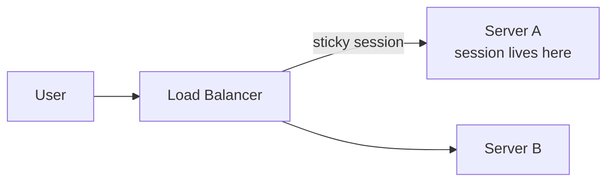
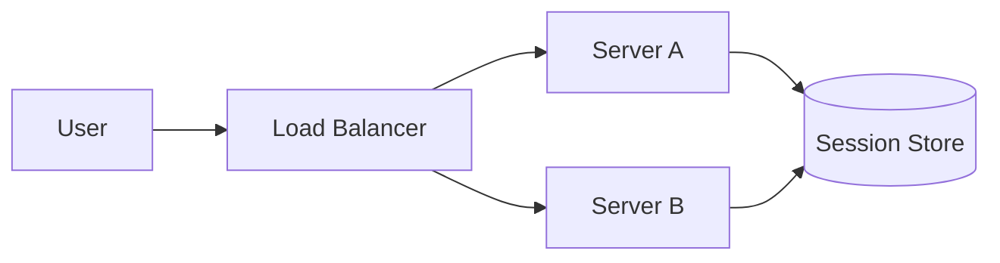
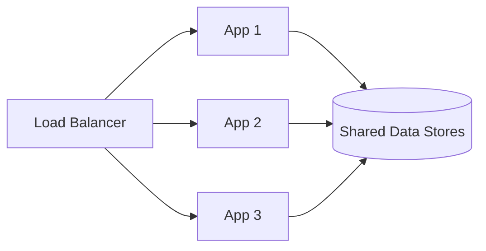

# Stateful vs Stateless Architecture

State describes information remembered between requests. In web systems, the most common example is user session data.

The question is where that state lives.

## Stateful Architecture

In a **stateful** architecture, the server that handles a user keeps session data locally. Later requests from that user must return to the same server.

This is common in older web applications that store sessions in local memory or local files.

Advantages:

- Simple for a single server.
- Fast local session access.
- Less external infrastructure at first.

Problems:

- Load balancing needs sticky sessions.
- If the server fails, the session may be lost.
- Scaling up and down moves users around.
- Traffic can become uneven.
- Deployments are harder because active users are tied to instances.

## Stateless Architecture

In a **stateless** architecture, application servers do not keep required user session data locally. Each request contains enough information to be processed, or the server reads shared state from an external store.

Session state may live in:

- A database.
- Redis or another distributed cache.
- A signed client-side token such as a JWT.
- An identity provider.

## Why Stateless Services Scale Better

If any server can handle any request, the load balancer can distribute traffic freely. Instances can be added, removed, replaced, or restarted without moving local user state.

This does not mean the whole system has no state. It means the application servers are not the source of truth for state.

## Trade-offs

| Design | Benefit | Cost |
| --- | --- | --- |
| Local server sessions | Simple early design | Harder scaling and failover |
| Shared session store | Easier scaling | Extra dependency |
| Client-side token | No server session lookup | Revocation and token size concerns |
| Database-backed state | Durable | Slower than memory |

## Design Questions

- What state is required between requests?
- Where is the source of truth?
- What happens if one app server dies?
- Does the load balancer need sticky sessions?
- Can users continue after a deployment?
- How are tokens, sessions, and permissions revoked?

## Check Your Understanding

<quiz>
What does "stateless application server" mean?

- [x] The server does not keep required session state locally between requests
> Correct. State may still exist, but it lives in shared storage or travels with the request.
- [ ] The whole system stores no data
- [ ] The application cannot use a database
- [ ] The server never authenticates users
</quiz>

