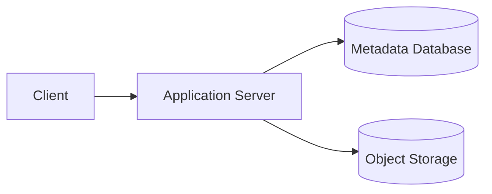
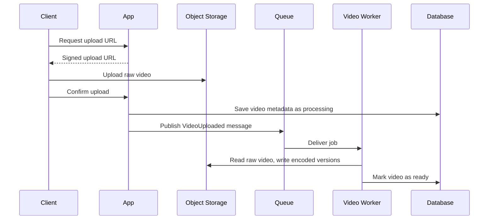
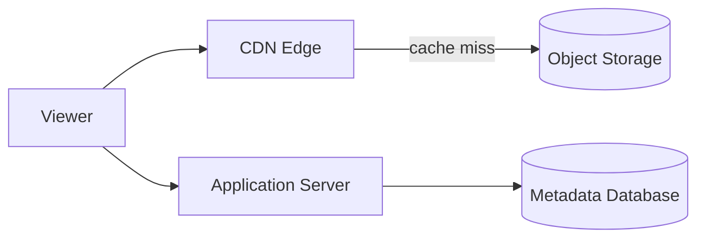
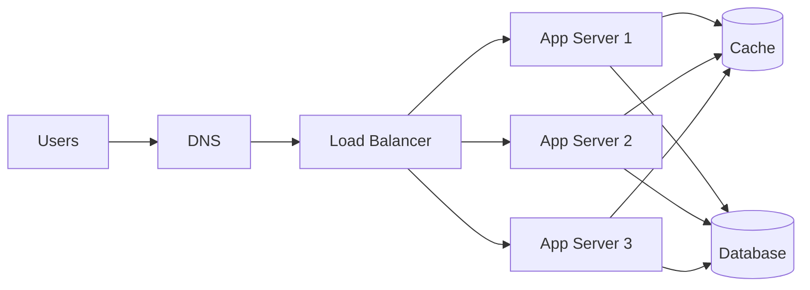
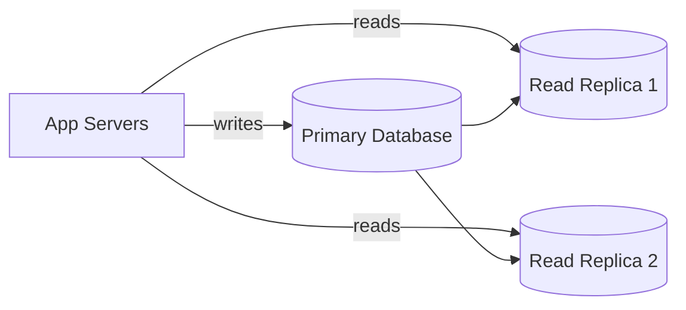
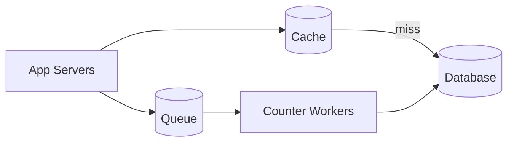
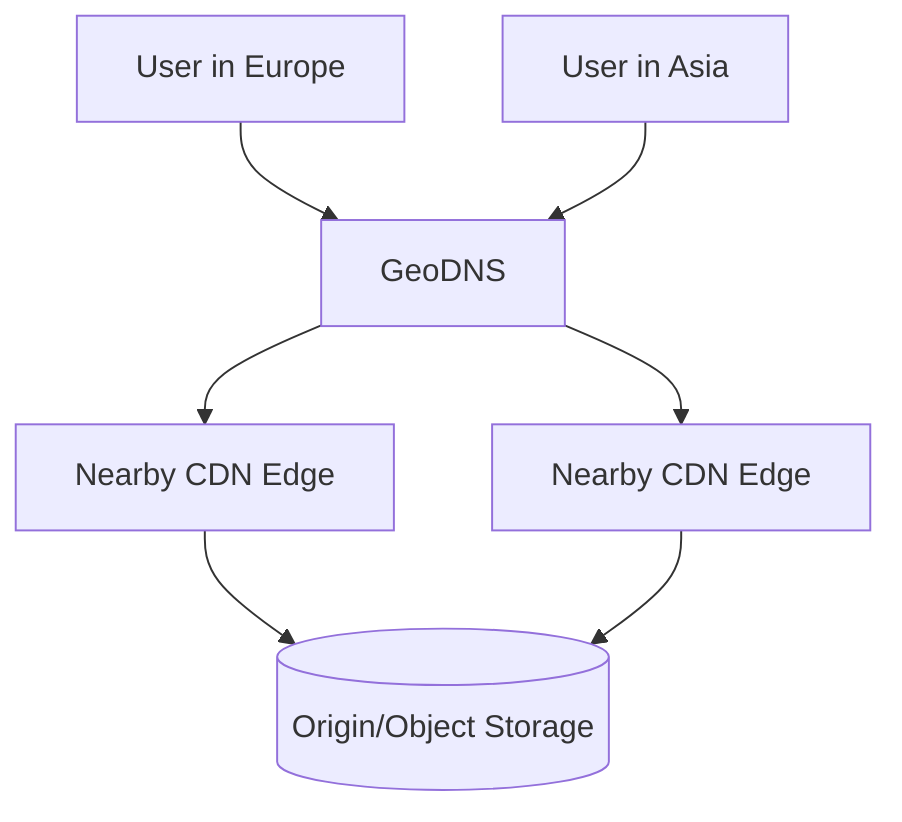
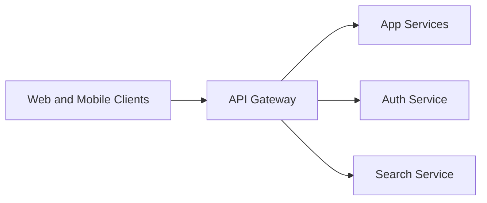
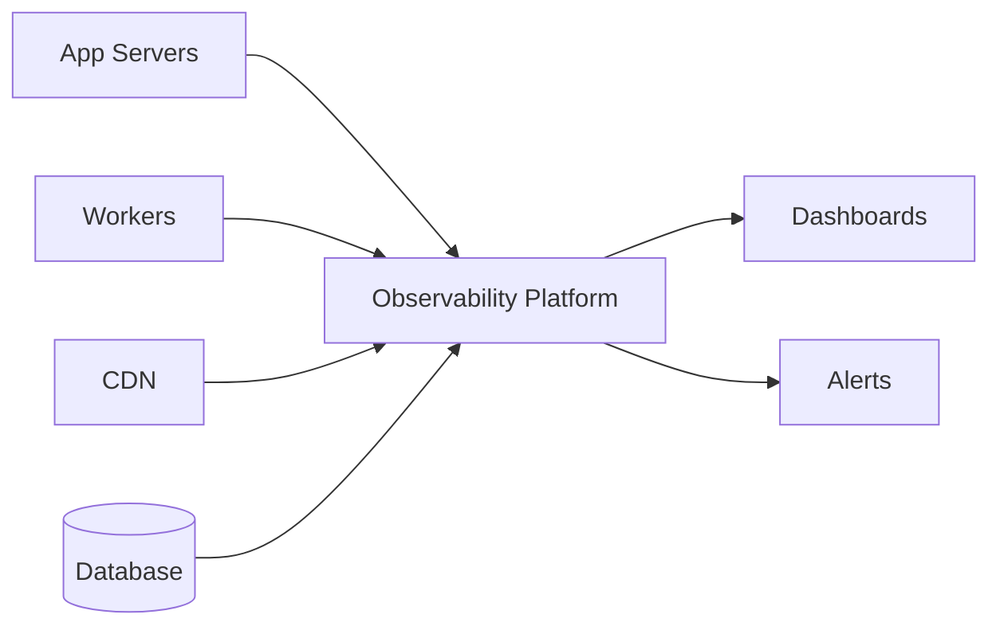
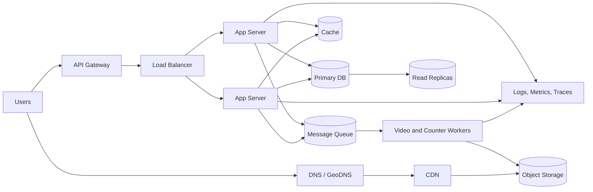

# Worked Example - Video Platform

This example designs a simplified video platform similar to YouTube. The goal is not to copy any real company's architecture, but to practice adding system design components incrementally.

## Requirements

Functional requirements:

- Users can upload videos.
- Users can watch videos.
- Users can search or browse videos.
- The system stores metadata such as title, description, owner, and upload time.
- The system tracks basic engagement such as views and likes.

Non-functional requirements:

- Video playback should be fast globally.
- Upload processing can happen asynchronously.
- The system should tolerate server failures.
- Popular videos should not overload the origin servers.
- Observability is required for playback errors, processing delays, and infrastructure health.

## Start Simple

The smallest design has a client, an application server, a database, and object storage.

The database stores metadata. Object storage stores the video files, thumbnails, and generated versions.

This works for a tiny product, but video processing is slow. Upload requests should not wait for every encoding step.

## Add Upload Processing

Use a message queue to decouple upload completion from background processing.

Workers can generate:

- Multiple resolutions.
- Thumbnails.
- Preview clips.
- Captions or transcripts.
- Safety or copyright review jobs.

If processing fails, the queue can retry the job. After repeated failures, the message can move to a dead-letter queue for inspection.

## Add Playback Scale

Playback traffic is usually much larger than upload traffic. Serve videos through a CDN instead of making every viewer hit object storage or application servers.

The client asks the application for video metadata and playback URLs. The video bytes come from the CDN.

This improves:

- Latency.
- Origin bandwidth.
- Global availability for popular content.
- Traffic spike handling.

## Add Application Scaling

Application servers should be stateless so any server can answer metadata, search, profile, or engagement requests.

The load balancer spreads requests across healthy app servers. Shared state lives in the database, cache, or signed tokens rather than local server memory.

## Add Database Read Scale

Metadata reads can become heavy: video pages, channel pages, recommendations, and browse results all need data.

The primary handles writes such as uploads, title edits, likes, and comments. Replicas handle read-heavy pages.

Because replicas may lag, some reads should still go to the primary. For example, after a creator edits a title, the creator should see the new title immediately.

## Add Caching

Cache frequently read metadata and counters.

Good cache candidates:

- Video metadata for popular videos.
- Channel summaries.
- Public user profile snippets.
- Homepage or category fragments.
- Authorization/session lookups.

Be careful with counters such as views and likes. Exact real-time counts are expensive at high traffic. Many systems batch or approximate view updates, then periodically write aggregated values.

## Add Global Routing

For global users, DNS and CDN handle much of the routing.

If the application itself runs in multiple regions, the design must also answer data questions:

- Which region accepts writes?
- How is metadata replicated?
- Can a user upload in one region and watch immediately in another?
- What happens if regions cannot talk to each other?

Do not add multi-region writes casually. CDN distribution is often enough for early video playback scale.

## Add API Gateway

An API gateway can centralize edge behavior.

The gateway may handle authentication, rate limiting, request logging, and routing to internal services.

## Add Observability

A video platform needs visibility into both request/response traffic and background media pipelines.

Important signals:

- Playback start latency.
- CDN cache hit ratio.
- Video buffering rate.
- Upload success rate.
- Queue depth and message age.
- Encoding duration and failure rate.
- App error rate and p95/p99 latency.
- Database replication lag.
- Object storage errors.

Alerts should point to user impact or urgent leading indicators. For example, "encoding queue message age is above 30 minutes" is more useful than "one worker restarted once."

## Final Shape

## Trade-offs to Discuss

- Strong consistency is expensive for global counters.
- CDN caching improves playback but complicates content removal and freshness.
- Object storage is excellent for video bytes, but metadata still needs a database.
- Queues improve upload responsiveness, but introduce retry, ordering, and dead-letter handling.
- Stateless app servers scale well, but shared state stores become critical dependencies.
- Multi-region applications improve latency and resilience, but make data consistency much harder.

## Check Your Understanding

<quiz>
Why should video encoding happen through workers and a queue instead of inside the upload request?

- [x] Encoding is slow and failure-prone, so asynchronous workers keep the user request fast and allow retries
> Correct. The app can acknowledge the upload and process video formats in the background.
- [ ] Queues make object storage unnecessary
- [ ] Encoding must happen inside DNS
- [ ] Workers prevent the need for monitoring
</quiz>

